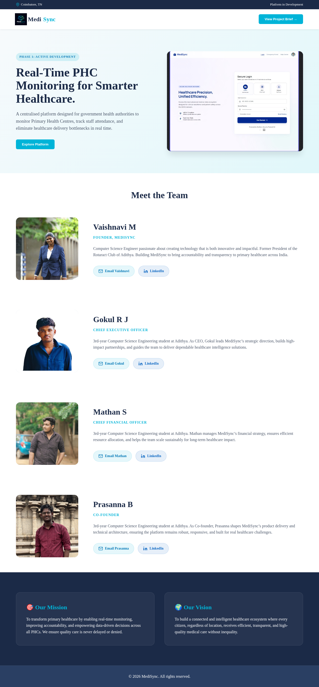

# MediSync

A medical dashboard UI built with HTML.

## Overview

A healthcare management dashboard interface featuring patient management, appointment scheduling, and medical records overview. Built as a front-end prototype.

## Features

- Dashboard overview with key metrics
- Patient management interface
- Appointment scheduling
- Medical records view
- Team/doctor profiles

## Tech Stack

- HTML5, CSS3

## Getting Started

Open `index.html` in a browser. No build step required.

## Project Structure

```
├── index.html             # Dashboard page
└── assets/                # Images and screenshots
    ├── logo.jpeg
    ├── dashboard.jpeg
    ├── dashboard-overview.jpeg
    ├── dashboard2.jpeg
    ├── login.jpeg
    └── [team photos].jpeg
```


## Screenshots


## License

MIT
